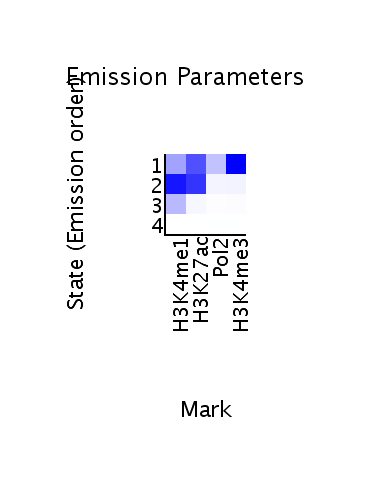
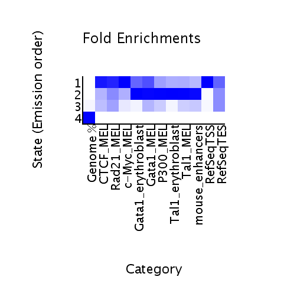

Overview
--------
This is a Snakefile demo to identify candidate enhancer regions in mouse
embryonic liver using data from PMID: 22763441.  This uses a different method
than the authors used to identify enhancers.

Input is an internet connection (files are downloaded from GEO).  Output is 2,
3, 4, and 5-state models from ChromHMM.

Prepare
-------

* Install Snakemake: https://bitbucket.org/johanneskoester/snakemake.
  Snakemake blends the best of Bash, Python, and Makefiles.

* Download http://compbio.mit.edu/ChromHMM/.

* Edit `config.py` to point to the paths on disk.

* Prepare the BED files you'd like to check against chromatin states by adding
  them to the `compare/links` directory.  There are already some data from
  related ENCODE data (created by running the `get-data.py` script) and some
  positive mouse enhancers from enhancer.lbl.gov (from running
  `enhancer.lbl.gov.py`).  These files are small enough to include in the repo,
  hence they're not downloaded in the Snakefile.

Run
---
* Run `snakemake -npr` as a dry-run to see what will be run.
* Run `snakemake -pr -j$N` , where $N is the number of CPUs, to run the pipeline.

Output
------
For each number of states `$s`, see:

* `output/$s-state/webpage_$s.html` for the states,
* `output/$s-state/*_enrichment.png` for the enrichment with supplied BED
  files.
* `output/$s-stats/*_dense.bed` for a BED file to upload to UCSC.

For example, state 2 in this 4-state model has strongest emmission parameters
for marks we'd expect over enhancers, and has the strongest enrichment for
other factors we'd expect to be at/near enhancers.

